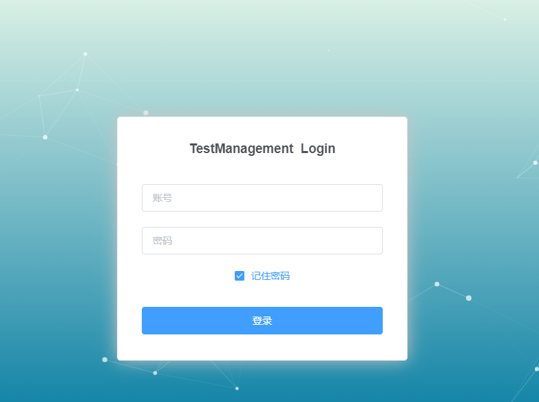
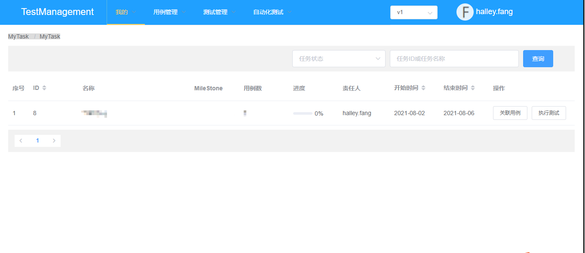
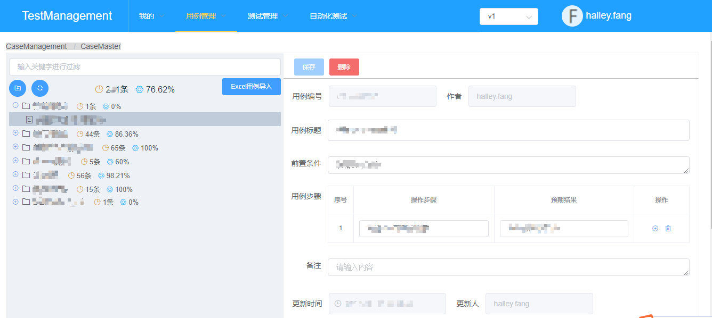
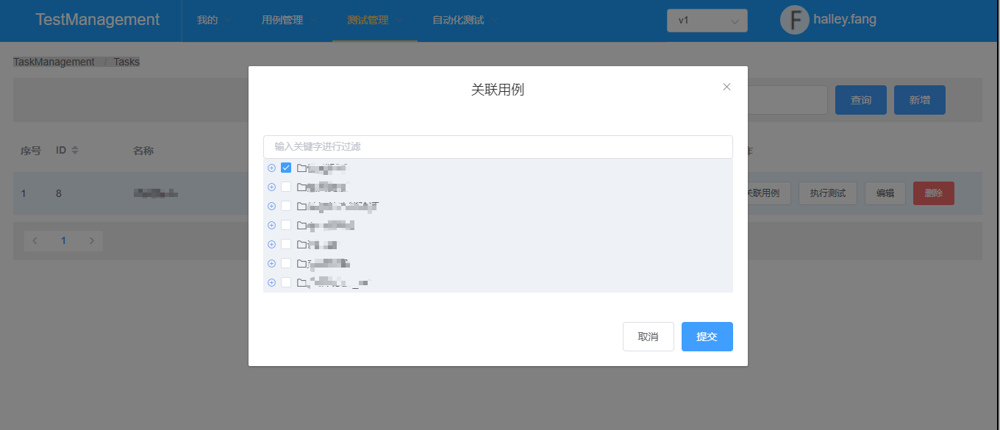
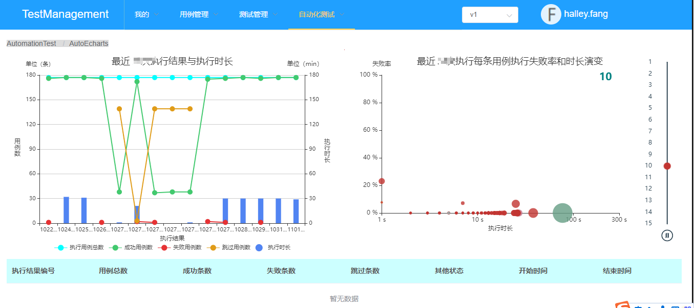

# 测试用例管理平台

## 主要功能

* 用例UI界面录入
* 用例Excel导入
* 用例树形视图管理
* 用例执行任务管理
* 自动化用例管理
* 用例执行结果报表

## 技术架构

* 前端 Vue+Element （前端代码在 vue-tm 库）
* 后端 SpringBoot+Shiro+Mybatis

## 系统截图

登录

工作台

用例管理

任务管理

自动化结果报表

